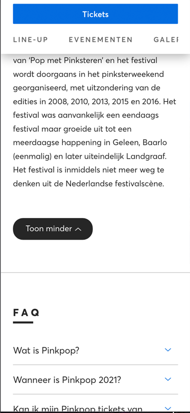

# Procesverslag
**Auteur:** Marloes Tacx

Markdown cheat cheet: [Hulp bij het schrijven van Markdown](https://github.com/adam-p/markdown-here/wiki/Markdown-Cheatsheet). Nb. de standaardstructuur en de spartaanse opmaak zijn helemaal prima. Het gaat om de inhoud van je procesverslag. Besteedt de tijd voor pracht en praal aan je website.

## Bronnenlijst
1. https://stackoverflow.com/questions/8683528/embed-image-in-a-button-element
2. https://codepen.io/Mxrloes/pen/gOMydyp
3. -...-

## Eindgesprek (week 7/8)

-dit ging goed & dit was lastig-

**Screenshot(s):**

-screenshot(s) van je eindresultaat-

## Voortgang 3 (week 6)

-same as voortgang 1-

## Voortgang 2 (week 5)

-same as voortgang 1-

## Voortgang 1 (week 3)

### Stand van zaken

Het begin ging wel goed maar de details waren lastig.

Ik heb erg lopen stoeien met de header en footer, steeds wilde het juiste plaatje niet naar de volgende regel gaan.

**Screenshot(s):**

De homepagina, hier ben ik al best ver, alleen loop met nog een paar dingen te stoeien.

De Pinkpop pagina, hier heb ik alleen nog maar de content erop gezet.

### Agenda voor meeting

-samen met je groepje opstellen-

| student 1      | student 2          | student 3    | student 4        |
| ---            | ---                | ---          | ---              |
| dit bespreken  | en dit             | en ik dit    | en dan ik dat    |
| an dat ook nog | dit als er tijd is | nog een punt | dit wil ik zeker |
| ...            | ...                | ...          | ...              |

### Verslag van meeting

-na afloop snel uitkomsten vastleggen-

## Breakdownschets (week 1)

## Intake (week 1)

**Je startniveau: rood**

**Je focus: responsive**

**Je opdracht: https://www.ticketmaster.nl** 

**Screenshot(s) van de eerste pagina (small screen): Home pagina**

**Screenshot(s) van de tweede pagina (small screen): Pinkpop pagina**

