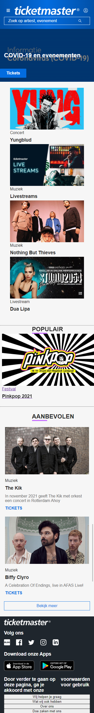

# Procesverslag
**Auteur:** Marloes Tacx

Markdown cheat cheet: [Hulp bij het schrijven van Markdown](https://github.com/adam-p/markdown-here/wiki/Markdown-Cheatsheet). Nb. de standaardstructuur en de spartaanse opmaak zijn helemaal prima. Het gaat om de inhoud van je procesverslag. Besteedt de tijd voor pracht en praal aan je website.

## Bronnenlijst
1. https://stackoverflow.com/questions/8683528/embed-image-in-a-button-element
2. https://codepen.io/Mxrloes/pen/gOMydyp
3. https://developer.mozilla.org/en-US/docs/Web/CSS/::after
4. https://developer.mozilla.org/en-US/docs/Web/CSS/white-space
5. https://webdevetc.com/blog/how-to-add-a-gradient-overlay-to-a-background-image-using-just-css-and-html/
6. https://codepen.io/robertspier/pen/VwKWKxZ
7. https://stackoverflow.com/questions/2204634/how-to-disable-automatic-links-coloring-without-selecting-a-color
8. https://stackoverflow.com/questions/10040842/add-border-bottom-to-table-row-tr

## Eindgesprek (week 7/8)

In de laatste weken heb ik veel aan het responsive maken van de website gewerkt, dit vond ik lastiger dan gedacht. Uiteindelijk is het wel geworden zoals ik wilde en ben daar best blij mee. Het evenementen blok is niet geworden zoals ik het wilde helaas.

**Screenshot(s):**

-screenshot(s) van je eindresultaat-

Einderesultaat van de homepagina voor mobiel

Einderesultaat van de homepagina voor desktop

Einderesultaat van de pinkpoppagina voor mobiel

Einderesultaat van de pinkpoppagina voor desktop

## Voortgang 3 (week 6)

### Stand van zaken

Deze week ben ik niet heel veel bezig geweest met de website en heb alleen een beetje de feedback verwerkt. Ik heb nogsteeds moeite met het evenementen blokje en de styling hiervan.

**Screenshot(s):**

De homepagina, hier heb ik niet zo heel veel veranderd wel kloppen eindelijk de buttons in de footer.

De Pinkpop pagina hier heb ik onderandere het evenementen gedeelte aangepast en de tekst in de header afbeelding staat nu goed.

### Verslag van meeting
De meeting ging weer erg goed, goede feedback gehad op de website en tips gehad over dingen waar ik tegen aan liep zoals het laten zien van meer items op mobiel en wat ik het beste met het evenementen blok kon doen. 

## Voortgang 2 (week 5)

### Stand van zaken

Ik ben deze weken bezig geweest met de tweede pagina, voor het grootste gedeelte is deze nu af en ga ik hierna bezig om de website responsive te maken.

**Screenshot(s):**

De homepagina, is nu bijna af, alleen de footer kloppen de links nog niet.

De Pinkpop pagina, hier ben ik de afgelopen weken het meeste mee bezig geweest. Deze is bijna af, alleen het FAQ gedeelte klopt nog niet, de tekst in de header afbeelding en de evenementen. 

### Verslag van meeting
De meeting ging goed, heb goede feedback gekregen op wat punten waarop ik vast liep en tips gehad voor hoe ik dingen beter kan doen zoals een main toevoegen en die een padding geven.

## Voortgang 1 (week 3)

### Stand van zaken

Het begin ging wel goed maar de details waren lastig.

Ik heb erg lopen stoeien met de header en footer, steeds wilde het juiste plaatje niet naar de volgende regel gaan.

**Screenshot(s):**

De homepagina, hier ben ik al best ver, alleen loop met nog een paar dingen te stoeien.

De Pinkpop pagina, hier heb ik alleen nog maar de content erop gezet.

### Verslag van meeting

Ik was al goed opweg en verder dan de docent verwacht had, code zag er netjes uit alleen moest ik sommige sections classes geven ipv de elementen. Verder heb ik goede feedback gehad op een paar punten waarop ik vast liep zoals het logo en de afbeelding in de eerste section een achtergrond maken.

## Breakdownschets (week 1)

## Intake (week 1)

**Je startniveau: rood**

**Je focus: responsive**

**Je opdracht: https://www.ticketmaster.nl** 

**Screenshot(s) van de eerste pagina (small screen): Home pagina**

**Screenshot(s) van de tweede pagina (small screen): Pinkpop pagina**

